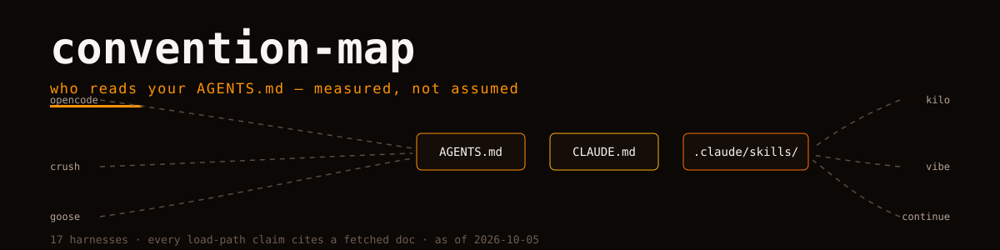

<picture>
  <source media="(prefers-color-scheme: dark)" srcset="hero.svg">
  
</picture>

# convention-map

Which instruction, memory and skill files each AI coding harness **loads**, from which paths, with what precedence — measured from official docs, one evidence URL per claim.

The ecosystem converged on a handful of convention files (`CLAUDE.md`, `AGENTS.md`, `SKILL.md`, skill directories) without anyone deciding it. This map is the measurement of that convergence: if you write your project's instructions once, where should they live to be read by the most harnesses?

## How to read it

- [matrix.md](matrix.md) — harness × convention-path grid. `●` = loaded as instruction/context file, `◆` = discovered as a skill directory.
- [harnesses/](harnesses/) — per harness: loaded paths with scope (global/project) and documented precedence, skill directories, learned-memory behavior, compatibility notes.
- Every cell links to the doc page it was read from, fetched during the research run (2026-10-05).

## The short answer

As of this snapshot (17 harnesses): `AGENTS.md` at the project root is read by **16 of 17** — the de-facto instruction interchange. For skills the field splits: `.agents/skills` is discovered by 13, while `.claude/skills` is discovered by 8, several of those purely for Claude-Code compatibility. Practical read: put instructions in `AGENTS.md`; put skills in `.agents/skills` and mirror into `.claude/skills` if you care about the compatibility tail. Read [SYNTHESIS.md](SYNTHESIS.md) for why that is an observation with an expiry date, not a standard.

## Regenerating

```bash
python3 scripts/generate.py <journal.jsonl> [...]
```

Same evidence contract as [harness-atlas](https://github.com/Orvii/harness-atlas): no memory answers, dates travel with claims, `unknown` over guess.

---

Orvii — Open, Research, Vision, Innovation & Ideas. Sister of [harness-atlas](https://github.com/Orvii/harness-atlas); the atlas maps capabilities, this maps the files they read.
